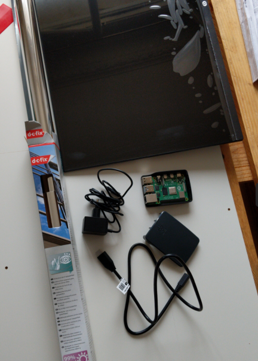
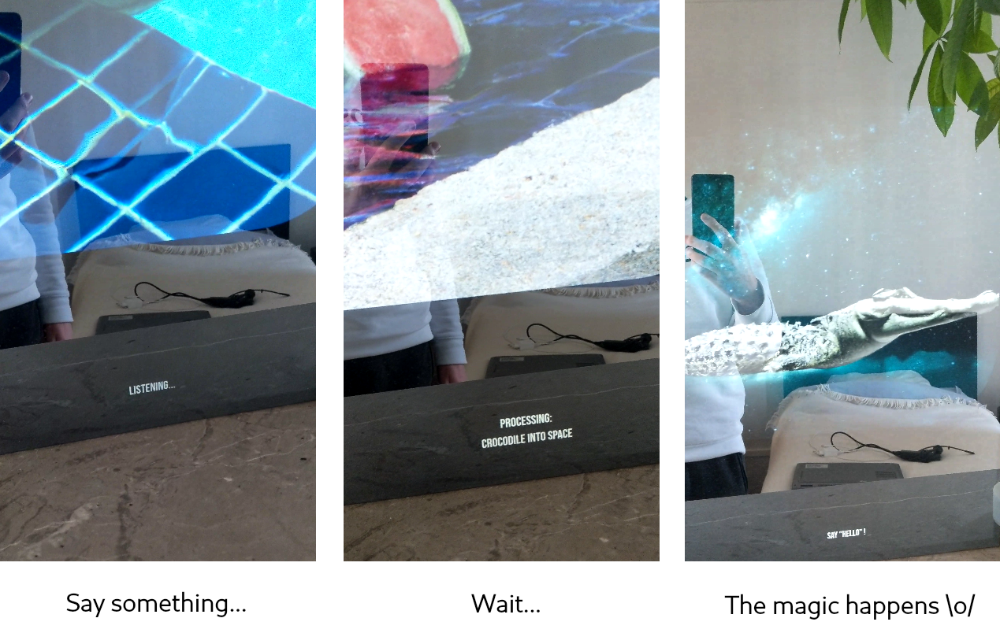
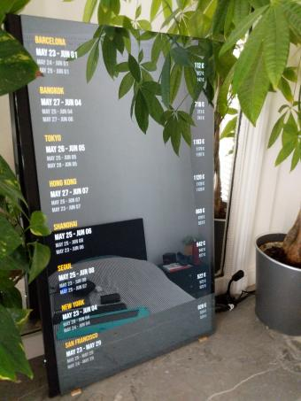

# Magic Mirror

Raspberry Pi Magic Mirror project, fully customized with:
 * AI images generation through voice recognition (**OpenAI Whisper**),
 * bank account balance (**scrapping and tesseract-ocr**),
 * best flight prices (**scrapping**),
 * Hacker News feed stream,
 * subway live timetable,
 * usual stuffs (weather, time, events...)

## Table of content

 * [Hardware](#hardware)
 * [Basics](#basics)
 * [AI images generation with voice](#ai-images-generation-with-voice)
 * [Bank account balance](#bank-account-balance)
 * [Best flight prices](#best-flight-prices)

## Hardware

Components:
 * Raspberry Pi 4 (2GB RAM version)
 * LCD monitor
 * Two way mirror plate ("spying mirror") with dimensions that fit the monitor (custom made by glazier craftsman)
 * USB microphone

Note there is no need for actually sticking or screwing the mirror plate on the screen: in my version, the plate simply leans against the monitor; just be sure it won't slip;

There is also no need for unmounting the monitor, neither it is necessary to take out only the LCD plate; as long as the screen is flat, the fact of being an actual monitor remains unoticed;

## Basics

Features:
 * date and time,
 * upcoming national, international and personal events,
 * weather,
 * news feed (Y Combinator Hacker News),
 * random compliments and love messages :two_hearts:

Setup in [basic configuration file](https://github.com/jean553/magic-mirror/blob/master/configs/basic_config.js)

## AI images generation with voice

Generate an AI image based on a voice text.

Required tools
 * USB microphone,
 * **arecord** and **sox** Linux tools,

How it works ?
 * a script continuously records audio input on the Raspberry Pi, making a new sound file of the recorded content every 5 seconds,
 * every 5 seconds, the content of the audio file is checked. especially if there is some sound volume in the file, indicating the user has actually said something (usually "Hello" to make the mirror start listening for more complex content),
 * if the audio file contains enough stuffs, then the mirror displays "Listening"; the script is now listening longer (15 seconds) for more content; the user can now pronounce the sentence he wants;
 * the audio file is sent through HTTP to a remove server of mine running both **nginx** on front and an **Open AI Whisper model** (those models need a lot of resources to run, the Raspberry Pi is not able to handle such computing tasks, hence why the model is running remotely on a machine with enough resources),
 * the text is extracted from the audio file and sent back as the HTTP response,
 * the text content is now sent to OpenAI Image Generation API,
 * some images are returned and displayed on the mirror

[Local script for audio input listening](https://github.com/jean553/magic-mirror/blob/master/commands/mm_speech_to_text.sh)

[AI image generation script](https://github.com/jean553/magic-mirror/blob/master/commands/ai_generation.py)

## Bank account balance

Display the current bank account balance.

How it works ?
 * basic scrapping (scrapping script not included in this repository),
 * **tesseract-ocr** to automatically handle bank login visual random digicode,

Recommendation for such external integrations: [Woob](https://woob.tech/)

## Best flight prices

List daily best flight prices in the upcoming weeks for some preferred destinations.

How it works ?
 * basic scrapping (scrapping script not included in this repository),
 * PHP command to extract the best flight price for each destination,
 * building of a final Magic Mirror module file

Example of [automatically generated JS module](https://github.com/jean553/magic-mirror/blob/master/configs/MMM-Plane-Tickets.js)

Example of [extracting command for the scrapped data](https://github.com/jean553/magic-mirror/blob/master/commands/SyncPlaneTicketsCommand.php)
