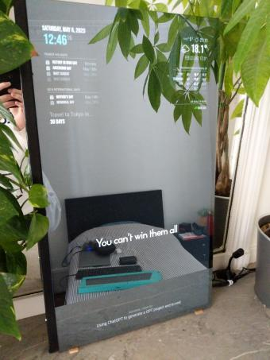

# Magic Mirror

Raspberry Pi Magic Mirror project, fully customized with:
 * AI images generation through voice recognition (**OpenAI Whisper**),
 * bank account balance (**scrapping and tesseract-ocr**),
 * best flight prices (**scrapping**),
 * Hacker News feed stream,
 * subway live timetable,
 * usual stuffs (weather, time, events...)

## Table of content

 * [Hardware](#hardware)
 * [Basics](#basics)
 * [AI images generation with voice](#ai-images-generation-with-voice)
 * [Bank account balance](#bank-account-balance)
 * [Best flight prices](#best-flight-prices)

## Hardware

Components:
 * Raspberry Pi 4 (2GB RAM version)
 * LCD monitor
 * Two way mirror plate ("spying mirror") with dimensions that fit the monitor (custom made by glazier craftsman)
 * USB microphone

Note there is no need for actually sticking or screwing the mirror plate on the screen: in my version, the plate simply leans against the monitor; just be sure it won't slip;

There is also no need for unmounting the monitor, neither it is necessary to take out only the LCD plate; as long as the screen is flat, the fact of being an actual monitor remains unoticed;

## Basics

Features:
 * date and time,
 * upcoming national, international and personal events,
 * weather,
 * news feed (Y Combinator Hacker News),
 * random compliments and love messages :two_hearts:

Setup in [basic configuration file](https://github.com/jean553/magic-mirror/blob/master/configs/basic_config.js)

## AI images generation with voice

## Bank account balance

Display the current bank account balance.

How it works ?
 * basic scrapping (scrapping script not included in this repository),
 * **tesseract-ocr** to automatically handle bank login visual random digicode,

Recommendation for such external integrations: [Woob](https://woob.tech/)

## Best flight prices

List daily best flight prices in the upcoming weeks for some preferred destinations.

How it works ?
 * basic scrapping (scrapping script not included in this repository),
 * PHP command to extract the best flight price for each destination,
 * building of a final Magic Mirror module file

Example of [automatically generated JS module](https://github.com/jean553/magic-mirror/blob/master/configs/MMM-Plane-Tickets.js)

Example of [extracting command for the scrapped data](https://github.com/jean553/magic-mirror/blob/master/commands/SyncPlaneTicketsCommand.php)
